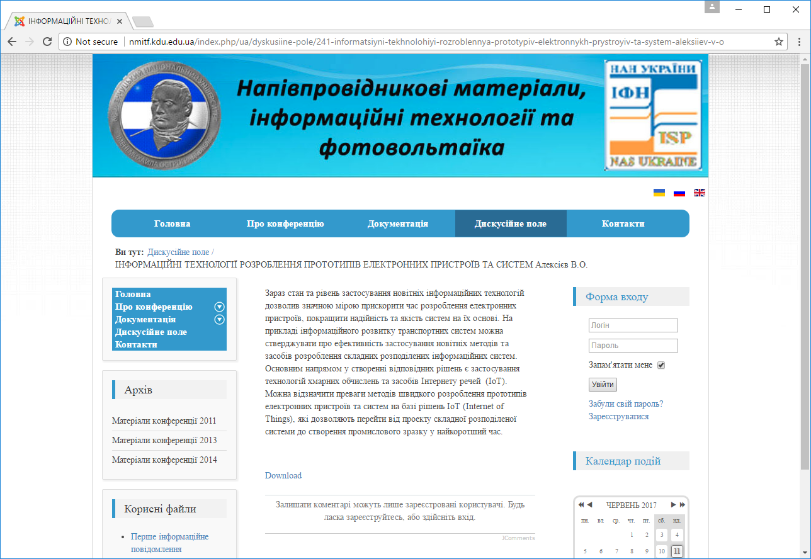
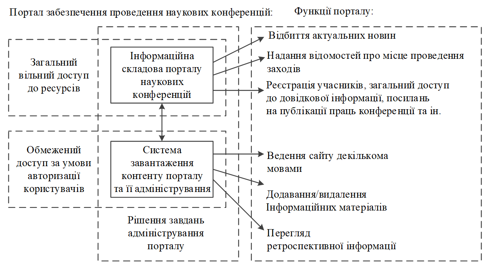
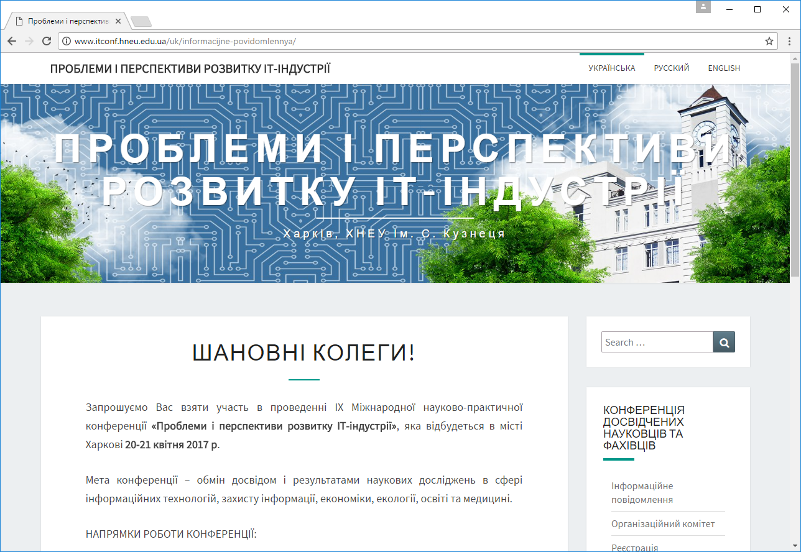
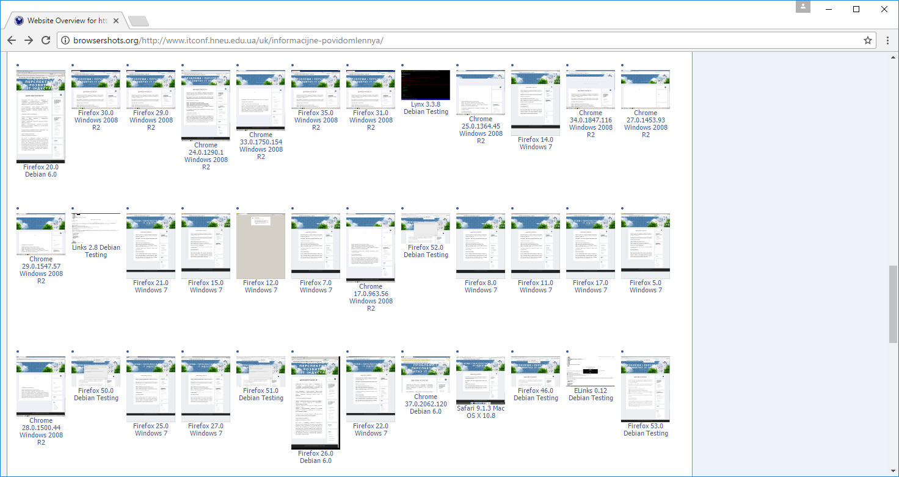
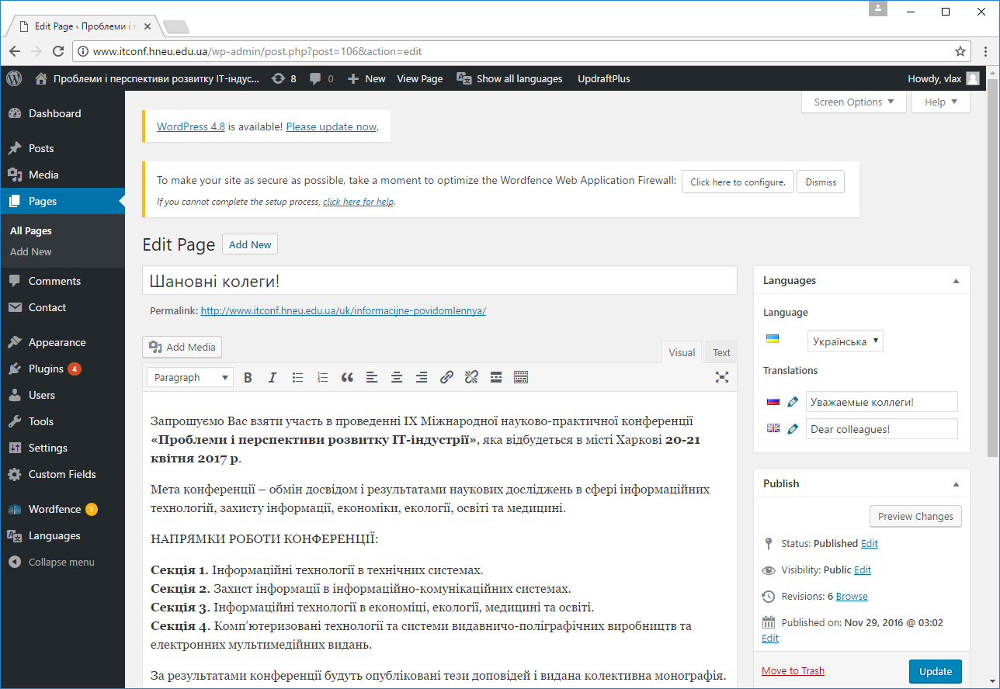
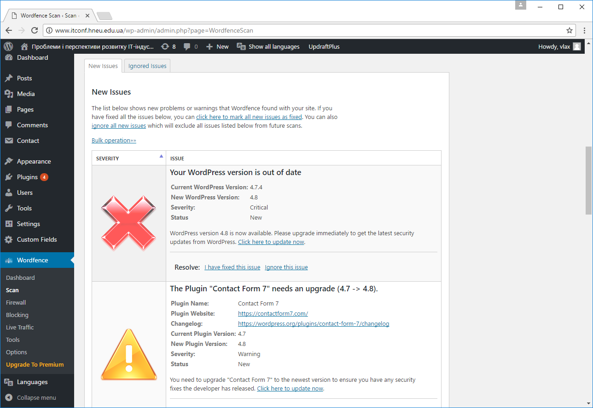
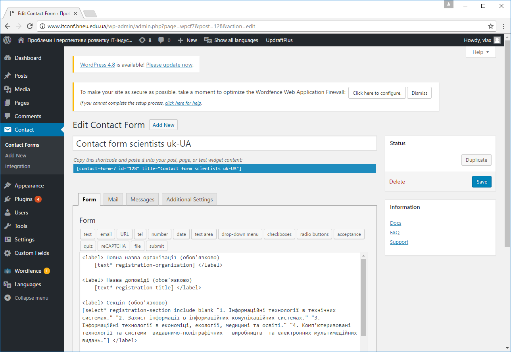
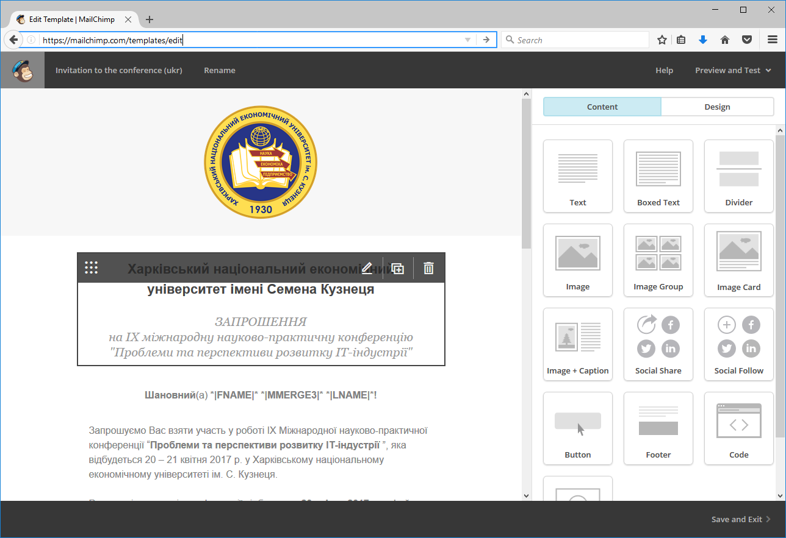

# Технології WordPress для організації та проведення наукових конференцій

Підтримка та розвиток інформаційних ресурсів [ХНЕУ ім. С. Кузнеця](https://www.hneu.edu.ua/). Кафедра [кібербезпеки та інформаційних технологій](http://www.kafcbit.hneu.edu.ua/).

---

## Огляд існуючих рішень

Ефективне проведення наукових досліджень та покращення якості науково-технічних робіт значною мірою залежить від спілкування науковців щодо обговорення та висвітлення сучасних проблем науки та техніці на спеціалізованих конференціях. Тому доцільно визначити засоби швидкого розгортання та підготовки веб-платформи для організації та проведення наукових конференцій. 

Для рішення питання створення інформаційного сайту конференції можна обрати декілька рішень, наприклад, обрати платформу [Open Conference Systems](https://pkp.sfu.ca/ocs/), яка дозволяє:

* створити веб-сайт конференції;
* скласти та відправити запити щодо тез конференції;
* в електронному вигляді приймати матеріали та тези доповідей;
* учасникам (авторам) редагувати свої роботи;
* розмістити матеріали конференції та документи у форматі пошуку;
* здійснювати повідомлення;
* виконувати реєстрацію учасників;
* застосовувати після конференції технології обговорення онлайн.

Також визначена платформа Open Conference Systems інтегрується із системою Open Journal Systems та іншими наробками проекту Public Knowledge Project. Для установки системи необхідними є застосування веб-серверу, на якому має бути встановлені: інтерпретатор PHP на базі Apache або Microsoft IIS, база даних MySQL або PostgreSQL. Система є вільною. Однак можна зазначити, що вона більш задовольнить вимогам розгортання платформи постійно діючої конференції, яка буде інтегруватися із видавництвом журналу чи іншого наукового видання.

Для Open Conference Systems можна у якості недоліка визначити складність застосування цієї платформи для непідготовлених користувачів та адміністраторів, поруч із спеціалізованим характером системи, що спрямовано тільки на вирішення завдань проведення конференцій. Також слід відзначити відносно обмежене число наявних розширень для цієї системи.

Слід відмітити досвід Харківського національного автомобільно-дорожнього університету, у якому для проведення конференцій застосовується вільна платформа дистанційної освіти [Moodle](https://moodle.org/) поруч із розгорнутою системою телеконференцій  [BigBlueButton](https://bigbluebutton.org/). Це також є продуктивною та зручною системою для виконання завдань щодо проведення наукових закладів, однак, потребує певних організаційних та технічних рішень щодо розгортання серверної частини системи.

Розглянуті рішення дозволяють створити розвинену платформу для проведення наукових заходів, однак, впровадження відповідних систем повинно бути скоординоване із інтеграцією до існуючих веб-сайтів та порталу рівня навчального закладу. Це обумовлює, наприклад, потребу у запуску серверу LDAP (Lightweight Directory Access Protocol – полегшений протокол доступу до каталогів) для забезпечення централізованого керування обліковими записами користувачів. 

Іншим напрямом є фактичний відказ від застосування веб-платформи та залучення тільки загальних Інтернет-сервісів, наприклад, Google-пошта, групи, робота із документами та ін. Ці засоби ефективні та зручні у застосуванні, однак, не надають єдиної точки входу до онлайн-події. Тому, можна стве-рджувати про необхідність застосування інформаційного сайту, наприклад, на базі офіційного веб-порталу університету чи іншої установи, яка виконує загальну організацію наукової конференції. Це надає можливості своєчасного інформування учасників заходу.

## Обґрунтування вибору платформи

Визначимо, що не завжди існуючий сайт або веб-портал навчального або наукового закладу є дійсно зручним та ефективним інструментальним засобом для виконання завдань проведення конференцій. Наприклад, у більшості випадків, такий ресурс дозволяє публікувати новини та інформаційні повідомлення, а для проведення реєстрації, опитувань, спілкування на онлайн-форумі та ін. слід застосовувати сторонні сервіси та ресурси. Такий спосіб організації веб-платформи конференції значно простий, однак, потребує додаткових дій щодо інформування учасників про особливості інших сервісів.

Слід відзначити досвід Кременчуцького національного університету імені Михайла Остроградського щодо проведення IV міжнародної науково-практичної конференції «Напівпровідникові матеріали, інформаційні технології та фотовольтаїка» (НМІТФ-2016), 26 – 28 травня 2016 року. Для досягнення головної мети конференції щодо об’єднання зусиль вчених, дослідників, винахідників та бізнесменів для розвитку вітчизняної науки, напівпровідникової промисловості та сонячної енергетики, було розгорнуто сайт-сателіт головного сайту університету на вільній платформі Joomla. На базі Joomla НМІТФ-2016 було організовано систему реєстрації учасників конференції, завантаження тез доповідей, їх попередню публікацію із можливістю обговорення змісту.



*Рисунок 1 – НМІТФ-2016. Приклад сайту наукової конференції*

Рішення веб-платформи для проведення наукових конференцій на базі стандартної системи керування вмістом [Content Management System, CMS](https://uk.wikipedia.org/wiki/%D0%A1%D0%B8%D1%81%D1%82%D0%B5%D0%BC%D0%B0_%D0%BA%D0%B5%D1%80%D1%83%D0%B2%D0%B0%D0%BD%D0%BD%D1%8F_%D0%B2%D0%BC%D1%96%D1%81%D1%82%D0%BE%D0%BC) є дуже гнучким та швидким за часом розгортання. Однак, можна запропонувати більш зручну та інтуїтивно-зрозумілу відкриту систему [WordPress](https://wordpress.org/). Перевагою такого рішення є порівняно невеликі вимоги системи до комп’ютерних ресурсів, зручність адміністрування та ін. 

За аналогією із розробкою архітектури [інформаційного порталу](http://ikt.khadi.kharkov.ua), який побудовано на платформі WordPress та, наприклад, призначеного для надання інформаційних ресурсів учасникам руху та транспортним організаціям, можна запропонувати відповідну архітектуру веб-ресурсу (чи сайту-сателіту основного веб-порталу академічної установи) для забезпечення завдань інформаційної підтримки для проведення наукових закладів.

 

*Рисунок 2 – Структура складових порталу забезпечення проведення наукових заходів*

Впровадження визначеного порталу повинно сприяти покрашенню рішенню завдань організації наукових конференцій. Інформаційна складова порталу призначена для надання знань щодо відомостей про заходи. Аудиторія порталу складається з фахівців-науковців, студентів та викладачів ВНЗ та загальних користувачів ресурсу. Інформаційні ресурси та сервіси Інтернет-порталу поєднують учасників конференції та надають їм віртуалізований єдиний інформаційний простір для обговорення проблем та постановки завдань щодо роботи конференції.

Визначений портал має готовий набір Веб 2.0 сервісів в єдиній компонентній архітектурі. Застосування у проекті технологій Веб 2.0 обумовлене наданням сервісів та послуг Інтернету, які дозволяють користувачам ресурсу брати активну участь в його функціонуванні та розвитку. Портал у вигляді прототипу розроблено та введено до експлуатації із застосуванням загальносистемного програмного забезпечення за адресою: [http://www.itconf.hneu.edu.ua/](http://www.itconf.hneu.edu.ua/).

*Таблиця 1 - Специфікація програмного забезпечення інформаційного порталу*

Призначення                             | Характеристика
------------                            | ------------
Платформа 	                            | Операційна система – Linux
Сервер додатків	                        | Apache із підтримкою PHP
Засоби збереження контенту	            | Основний веб-ресурс на базі WordPress
Рішення специфічних задач комунікації	| Розробка клієнт-серверних додатків на мові PHP (застосування плагінів)
Система управління базами даних         | MySQL
Засоби забезпечення захисту інформації  | Застосування технологій шифрування, захист від несанкціонованого втручання через систему паролів

Технічне забезпечення веб-рішення базується на ресурсах комп’ютерної мережі Харківського національного економічного університету імені Семена Кузнеця. Визначений портал для проведення конференцій було орієнтовано на рішення завдань Міжнародної науково-практичної конференції молодих вчених, аспірантів та студентів "Інформаційні технології в сучасному світі: дослідження молодих вчених", що пройшла 9 – 10 лютого 2017 р. та  IX Міжнародної науково-практичної конференції "Проблеми і перспективи розвитку ІТ-індустрії", що пройшла 20 – 21 квітня 2017 р. Ця платформа підтвердила свою життєздатність та використовується для проведення конференцій й надалі.

## Особливості застосування WordPress

Метою проведення конференцій було визначено обговорення актуальних проблем і результатів теоретичних та практичних досліджень досвідчених та молодих учених, аспірантів та студентів в галузях проектування інформаційних систем, технологій захисту інформації, використання сучасних інформаційних технологій в управлінні системами, моделювання бізнес-процесів, застосування геоінформаційних технологій в дистанційній освіті та електронному навчанні, інформаційних технологій в видавничо-поліграфічній галузі, а також розроблення інструментальних засобів прикладної статистики.

Для спілкування із учасниками було зареєстровано поштову скриньку у сервісі [UKR.NET](https://www.ukr.net/). Веб-сервер розгорнуто на базі корпоративної платформи хостингу, що розділяється (shared), під керівництвом операційної системи FreeBSD. У якості шаблону теми обрано [Nisarg](https://wordpress.org/themes/nisarg/). Тема створена, як дочірня до Nisarg. Це дозволяє розвивати тему незалежно від змін основної.

 

*Рисунок 3 –  Головна сторінка порталу конференцій*

Показником якості Інтернет-порталу є підвищення інформативності його користувачів (учасників конференції та ін. зацікавлених), поруч з цим важливою є зручність роботи з веб-інтерфейсом. При вибору шаблону інтерфейсу користувача було враховано застосування не тільки традиційних комп’ютерних систем із повнорозмірним монітором (з роздільною здатністю порядку 1280х1024 та більше), широкоформатних моніторів (з роздільною здатністю 1366х768 та більше), але й порівняно застарілі системи (з роздільною здатністю 1024х768) та портативні пристрої, наприклад, планшети, нетбуки та смартфони (роздільна здатність може складати порядку 240х320 точок).

Можна залучити сервіс [Browsershots](http://browsershots.org/), який є одним з найбільш функціональний інструментів для [тестування кросбраузерності](https://seo-akademiya.com/baza-znanij/servisyi/servisyi-proverki-krossbrauzernosti/). Він включає в себе браузери для Linux, Windows і BSD. Відповідно, можна висловити, що веб-сторінка порталу однаково буде представлена для користувачів із різними системами роботи в мережі Інтернет.  


*Рисунок 4 – Сервіс Browsershots із результатами тестуванням* 

Інший сервіс – [Markup Validation Service](http://validator.w3.org/) або новітній [Nu Html Checker](https://validator.w3.org/nu/). Основне правило такого валідатора (перевірки відпо-відності) – відповідність специфікації. Це просто рекомендація, але потрібно розуміти, що дотримання стандартів – гарний тон та додаткова перевага для веб-сайту з точки зору пошукових систем.

Слід відзначити, що іншим напрямом тестування веб-ресурсу є його перевірка щодо працездатності за умов підвищенного навантаження запитами користувачів. [LoadImpact](https://loadimpact.com/) або [Loader.io](https://loader.io/) – це служби у хмарі для навантажувального тестування та оптимізації сайту. Вони генерують трафік, імітуючи користувачів. Кожна служба пропонує безкоштовний варіант, а також опційну платну підтримку, де надається доступ до більшого числа функцій.

Через наявність численних елементів, які не підвладні контролю розробника веб-ресурсу, а також в силу великої кількості взаємозалежних компонентів, в процесі проектування і тестування веб-додатків виникає безліч труднощів. Адекватне тестування таких додатків вимагає висунення деяких припущень щодо очікувань і поведінки користувачів, які будуть використовувати веб-сайт.

У веб-додатках існує багато місць виникнення потенційних збоїв, які необхідно враховувати, приймаючи рішення про те, який підхід до тестування краще використовувати. Користувачі веб-сайтів мають різний рівень підготовки, користуються браузерами різних типів, різними операційними системами і пристроями. Крім того, можна очікувати, що швидкість підключення для різних користувачів, які отримують доступ до сайту, буде мінятися в широких межах. Наприклад, це актуально для мобільних користувачів.

Продуктивність системи робить величезний вплив на формування першого враження користувача. Крім того, низька продуктивність додатка може викликати у відвідувачів сумніви в надійності сайту. Тому спочатку слід встановлювати цільові критерії продуктивності, а потім проектувати тести, які дозволять розкрити проблеми, що перешкоджають досягненню цих цілей.

Веб-додатки слід розглядати як клієнт-серверні додатки з трирівневої архітектурою:

* шар уявлення. Забезпечує користувальницький інтерфейс (UI);
* шар бізнес-логіки. Моделює бізнес-процеси додатки, такі як аутентифікація користувачів або обробка транзакцій;
* шар даних. Відповідає за зберігання даних, використовуваних програмою або отриманих від кінцевого користувача.

Залучення хмарних технологій дозволяє швидко та зручно виконати комплекс заходів тестування межи пікового навантаження на веб-ресурс. Однак, найбільшу гнучкість може надати тільки свій сервіс для здійснення завдань тестування. Зараз існує декілька програмних засобів для рішення завдань тестування максимуму навантаження запитів користувачів до веб-ресурсів (за матеріалами *Wikipedia*). 

Наприклад, [JMeter](https://jmeter.apache.org/) – інструмент для проведення навантажувального тестування, який розроблює Apache Project. Спочатку JMeter розроблявся як засіб тестування web-додатків, зараз він здатний проводити навантажувальні тести для JDBC-з'єднань, FTP, LDAP, SOAP, JMS, POP3, IMAP, HTTP та TCP. Програма має  можливість створення великої кількості запитів за допомогою декількох комп'ютерів при управлінні цим процесом з одного з них. Архітектура, підтримуюча плагіни сторонніх розробників, дозволяє допов-нювати інструмент новими функціями.

[Selenium](https://en.wikipedia.org/wiki/Selenium_(software)) – засіб для тестування Web-додатків. Це об'єктно-орієнтований JavaScript-додаток, який може аналізувати файли певної структури для того, щоб знаходити в них команди для маніпуляції браузером і команди для виконання певних дій і перевірок. 

В рамках проекту Selenium також випускається інструмент [Selenium IDE](https://chrome.google.com/webstore/detail/selenium-ide/mooikfkahbdckldjjndioackbalphokd?hl=uk). Цей інструмент дозволяє записувати і відтворювати скрипти, що представляють собою звичайні HTML-сторінки з однією таблицею, яка містить команди. У програмі реалізовані механізми авторизації віртуальних користувачів, підтримуються користувальницькі сеанси. Організовано логування результатів тесту і різноманітна візуалізація результатів у вигляді діаграм, таблиць та ін. 

Таким чином, визначено набір програмно-апаратних засобів тестування веб-ресурсу, наприклад, порталу для сприяння проведення наукових заходів. 

## Оптимізація та кастомізація веб-сайту

Поруч із визначенням архітектури системи, особливостей її тестування слід визначити засоби розширення стандартної поставки WordPress щодо виконання завдань прикладної області. 

Головним слід визначити, що ресурс міжнародної конференції повинен мати можливість застосування різних мов. Для рішення завдання мультимовного ресурсу обрано плагін [Polylang](https://polylang.pro/). Застосування розширення WordPress для реалізації завдань створення сайту із змістом на різних мовах дозволяє фактично дублювати кожну сторінку у базі даних системи на кожній мові відповідно. Такий підхід не залучає, наприклад, технологію автоматизованого перекладу, що значно впливає на якість контенту сайту. 
 

*Рисунок 5 – Інтерфейс адміністрування порталу конференцій* 

Можна побачити із скріншота, що сторінка, яка редагується, має пов’язані сторінки іншими мовами. Визначений плагін дозволяє автоматизувати роботу із меню сайту відповідно до обраної мови поточної сторінки.

У разі додавання до інтерфейсу сайту на WordPress певні додаткові компоненти (заголовки, абзаци, ін.) можна залучити плагін [Advanced Custom Fields](https://www.advancedcustomfields.com/). Це дозволить, наприклад додати відповідні написи у заголовку сайту, наприклад, застосувати такий код:

```php
<a class="navbar-brand" href="<?php echo esc_url( home_url('/'));?>">
	<?php //bloginfo('name');?>
	<?php switch (get_locale()) {
			case en_GB:
				echo get_field( 'site_title_en', 20);
				break;
			case ru_RU:
				echo get_field( 'site_title_ru', 17);
				break;
			case uk:
				echo the_field( 'site_title_uk', 14);
				break;
}?></div></a>
```

Підвищити якість сайту можливо не тільки завдяки зовнішнім діям із ресурсом, наприклад, можна застосувати плагін [Wordfence Security](https://www.wordfence.com/). Це розширення дозволяє виконувати завдання мережевого екрану, антівіруса, тестування якості сайту та багато ін.


*Рисунок 6 – Результат тестування сайту за допомогою Wordfence Security*

Поруч із цим доцільно застосувати на ресурсі, що пропонується, плагін UpdraftPlus – [Backup/Restore](https://updraftplus.com/). Це дозволить автоматизувати резервне копіювання та, у разі потреби, відновлення сайту із резервної копії. Важливо, що UpdraftPlus може виконувати збереження даних у стороннє сховище, наприклад, Amazon S3, Dropbox, Google Drive, Rackspace Cloud, DreamObjects, FTP, Openstack Swift, email та ін. Наприклад, для сайта щодо забезпечення проведення наукової конференції, який пропонується, доцільно застосувати сховище Dropbox, у якому виконувати збереження не тільки даних резевних копій, але й файли друкованих матеріалів конференції, наприклад, тез доповідей та ін.

Для рішення завдання розміщення форм щодо реєстрації користувачів доцільно залучити плагін [Contact Form 7](https://contactform7.com/). Він дозволяє у зручній формі виконати опис веб-форми, а у разі її заповнення надіслати відповідь на вказану адресу електронної пошти.
 

*Рисунок 7 – Розроблення веб-форми за допомогою Contact Form 7*

Відзначимо, що інформаційна технологія для організації та проведення наукових конференцій повинна забезпечити виконання комплексу завдань:

* поширення між потенційними учасниками інформаційного листа конференції;
* виконання завдань реєстрації учасників конференції;
* отримання та збереження матеріалів для видання тез доповідей, праць конференції тощо;
* розсилка повідомлень із запрошенням на участь у засіданнях конференції;
* повідомлення щодо результатів проведення заходу, публікації праць та тез конференції тощо.

Таким чином, можна виділити складне завдання масової розсилки пошти, що буде порівняно складно втілити за допомогою WordPress. Тому доцільно зареєструвати обліковий запис у сервісі [MailChimp](https://mailchimp.com/) та здійснювати розсилку повідомлень учасникам конференції за його допомогою.
 

*Рисунок 8 – Формування шаблону повідомлення у сервісі MailChimp*

Сервіс MailChimp дозволяє не тільки виконувати масову розсилку повідомлень на  електронні адреси, а поруч із цим надає зручні та інформативні інструменти аналітики, які дозволяють оцінити кількість прочитаних листів та якість компанії-розсилки щодо переходів адресантів за посиланнями у листах.

Також слід зазначити, що в залежності від кількості учасників конференції, може бути раціональним застосування зовнішніх платних сервісів, наприклад, розширеного акаунта MailChimp, або платформи для проведення опитувань [SurveyMonkey](https://www.surveymonkey.com/). Визначений сервіс здійснення опитувань користувачів дозволяє на безкоштовній основі збирати відповіді на листи з опитуваннями до 10 запитань та до 100 відповідей. Тому для міжнародних заходів, що передбачають залучення більш за 100 учасників, доцільним може бути застосування платного акаунта. 

Також, для перевірки наукових текстів на плагіат можливо застосувати сервіс [Unicheck](https://ua.unicheck.com/). Відповідно можна стверджувати, що у разі збільшення учасників наукових заходів доцільно залучати платні сервіси чи застосовувати більш функціональні плагіни системи WordPress, які у більшості є платними або застосовують можливості комерційних сервісів чи застосунків.

Поруч із технічними засобами призначеними переважно тільки для підтримки проведення наукових заходів, слід відзначити наявність завдань організаційного плану. Наприклад, процес проведення наукової конференції слід  розуміти як бізнес-завдання. Тому для рішення задач організаційного характеру зручним та ефективним може стати сервіс [Trello](https://trello.com/). Фактично цей сервіс надає користувачу електрону дошку сумісну за методологію виконання проектів [Kanban](https://netology.ru/blog/scrum-kanban). Ця технологія дозволяє поділити проект на етапи та відстежувати проходження завдань по визначених етапах.

Таким чином, раціональне поєднання комерційних та вільних засобів для створення єдиного інформаційного простору учасників наукового заходу дозволить ефективно скорегувати час на організацію проведення заходу та надати комфортних умов для всіх зацікавлених в участі. Відповідно запропоновано застосування платформи WordPress, поштового сервісу @UKR.NET, хмарного файлового сховища Dropbox та сервісу масового розсилання повідомлень MailChimp у якості єдиної платформи для забезпечення рішення завдань проведення наукових заходів та конференцій.

Публікацію підготував: *Володимир Алексієв*.


## Корисні посилання

1. WordPress Security Fundamentals - [Defiant Inc](https://www.wordfence.com/learn/).

