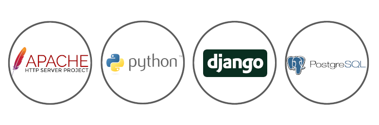
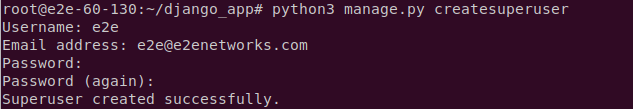
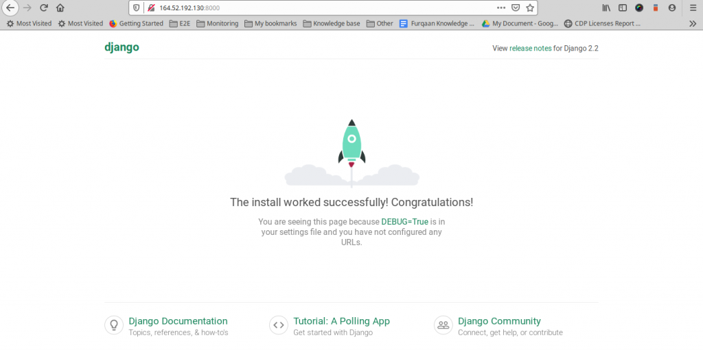
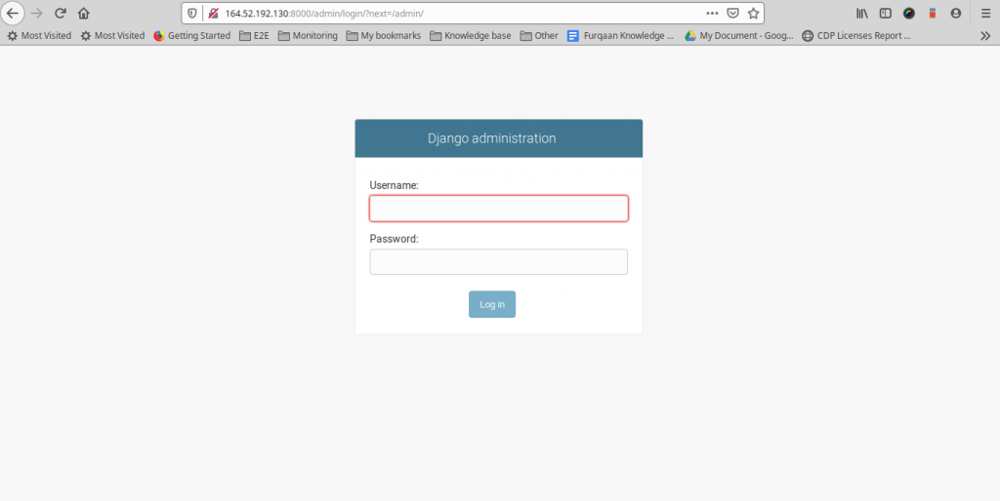

# Як встановити Django на Ubuntu 18.04 та 16.04 LTS

Підтримка та розвиток інформаційних ресурсів [ХНЕУ ім. С. Кузнеця](https://www.hneu.edu.ua/). Кафедра [кібербезпеки та інформаційних технологій](http://www.kafcbit.hneu.edu.ua/).

---

У даній статті буде розглянуто способ встановлення фреймворку Django на Ubuntu.

## Вступ 

Django - вільний фреймворк для веб-додатків на мові Python, що використовує шаблон проектування MVC. Проект підтримується організацією Django Software Foundation. Сайт на Django будується з одного або декількох додатків, які рекомендується робити відчужуваними і підключаються.


Django вважається кращим веб-фреймворком, написаним на Python. Цей інструмент зручно використовувати для розробки сайтів, що працюють з базами даних.

Django проектувався для роботи під управлінням Apache (з модулем mod_python) і з використанням PostgreSQL в якості бази даних. В даний час, крім PostgreSQL, Django може працювати з іншими СУБД: MySQL (MariaDB), SQLite, Microsoft SQL Server, DB2, Firebird, SQL Anywhere і Oracle. Для роботи з базою даних Django використовує власний ORM, в якому модель даних описується класами Python, і по ній генерується схема бази даних.



Деякі можливості Django:
* ORM, API доступу до БД з підтримкою транзакцій
* вбудований інтерфейс адміністратора, з уже наявними перекладами багатьма мовами
* диспетчер URL на основі регулярних виразів
* розширювана система шаблонів з тегами і спадкуванням
* система кешування
* підключається архітектура додатків, які можна встановлювати на будь-які Django-сайти
* «Generic views» - шаблони функцій контролерів
* авторизація та аутентифікація, підключення зовнішніх модулів аутентифікації: LDAP, OpenID та інші.
* система фільтрів ( «middleware») для побудови додаткових обробників запитів, як наприклад включені в дистрибутив фільтри для кешування, стиснення, нормалізації URL і підтримки анонімних сесій
* бібліотека для роботи з формами (успадкування, побудова форм по існуючої моделі БД)
* вбудована автоматична документація 


## Крок 1 - Встановлення Python та Pip (cистема управління пакетами)

Якщо ви запустили новий сервер, тоді радимо оновити сервер за допомогою наведеної нижче команди

```
sudo apt-get update
```
За замовчуванням Python 3 встановлюється на вашому комп'ютері, але якщо у вашій системі не встановлений Python, виконайте наведені нижче команди, щоб встановити його.

```
sudo apt-get install python3 
```

Для перевірки версії Python на вашій операційній системі введіть наступну команду:


```
$ python3 -V
Python 3.6.8
```
Щоб встановити pip, використовуйте команду нижче:

```
sudo apt-get install python3-pip
```
## Крок 2: Встановлення Django

Вихідний код Django доступний як сховище на Github. Ви також можете використовувати pip для встановлення Django в системах Ubuntu, для цього використовуємо команду:

```
pip3 install Django
```
Після встановлення Django Ви можете перевірити версію:

```
django-admin –version
```
## Крок 3: Створення програми на Django

Команда django-admin надає вам можливість створити нову програму Django за допомогою командного рядка. Перейдіть до каталогу, необхідного для створення нового додатка, і скористайтеся командою нижче

```
django-admin startproject django_app
```
Перейдіть до директорії та перенесіть зміни
```
cd django_app
python3 manage.py migrate
```

## Крок 4: Створення суперкористувача для програми Django

Створимо обліковий запис суперкористувача для адміністрування програми Django. Виконайте наступну команду з каталогу додатків Django.
```
python3 manage.py createsuperuser
```

Ви отримаєте результат, як показано нижче, введіть деталі



## Крок 5: Запустіть програму Django

Ваша програма Django готова до використання. За замовчуванням Django не дозволяє зовнішнім хостам отримувати доступ до веб-інтерфейсу. Щоб дозволити зовнішні хости, відредагуйте файл settings.py та додайте IP у розділі ALLOWED_HOSTS.

```
vim django_app / settings.py
```

Додайте IP

```
ALLOWED_HOSTS = ['your_server_IP']
```

Нарешті, запустіть сервер додатків Django за допомогою команди нижче

```
python3 manage.py runserver 0.0.0.0:8000
```
Зараз запущений сервер додатків Django. Відкрийте веб-браузер і отримайте доступ до програми Django із IP-адресою сервера на порту 8000. Це покаже вам веб-сторінку Django за замовчуванням.

Перш ніж отримати доступ до програми Django у браузері, вам потрібно відкрити порт на сервері, щоб отримати до нього зовнішній доступ. Зверніться до цієї статті, щоб відкрити порт на Iptables



Щоб використовувати адміністративний інтерфейс, увійдіть за допомогою / admin



Увійдіть за допомогою імені користувача та пароля, які були надані вами раніше на попередньому кроці

# Підсумки

За допомогою наданої інструкції ви зможете швидко та технічно правильно розгорнути Django на вашій ОС

Публікацію підготував: *Макаренко Антон*.

---

## Корисні посилання

1. https://ru.wikipedia.org/wiki/Django

2. https://www.digitalocean.com/community/tutorials/how-to-install-the-django-web-framework-on-ubuntu-18-04-ru

3. https://tutorial.djangogirls.org/ru/django/


