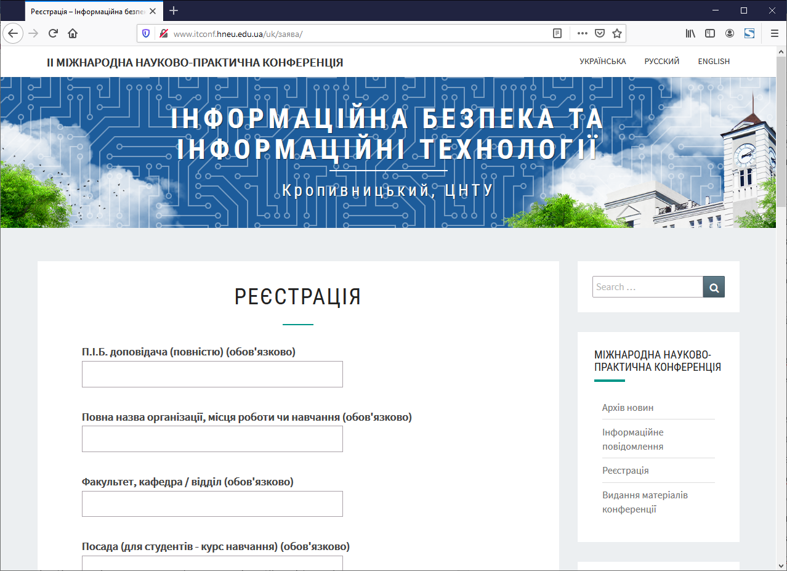
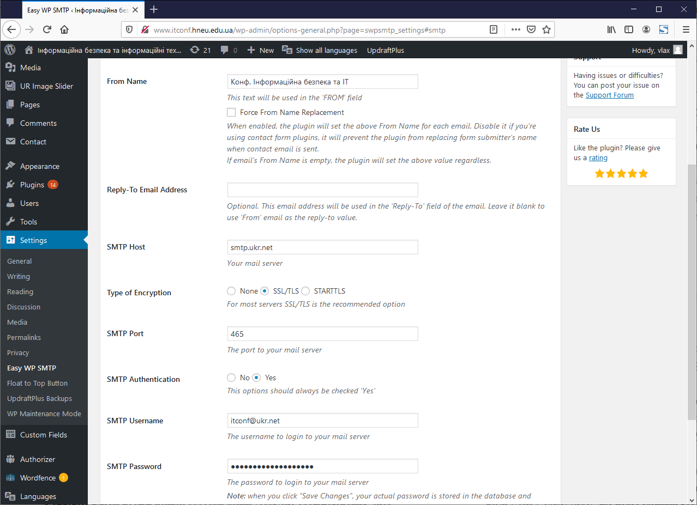
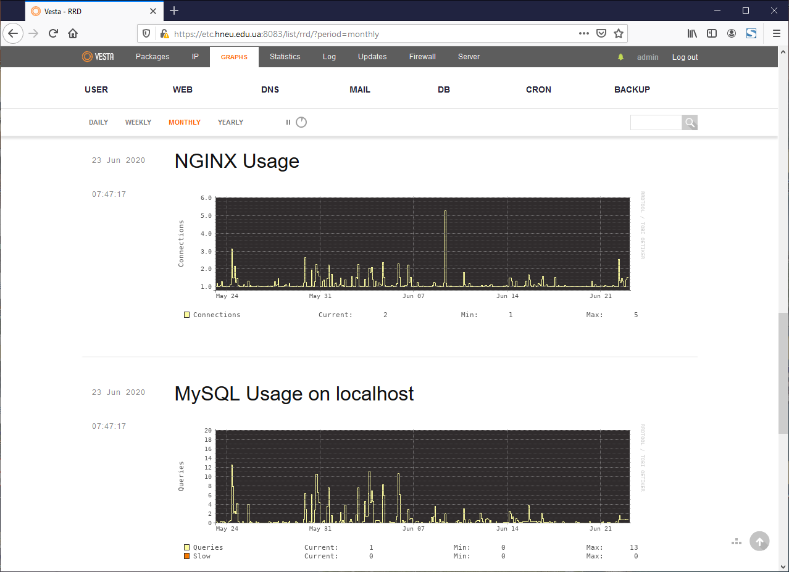
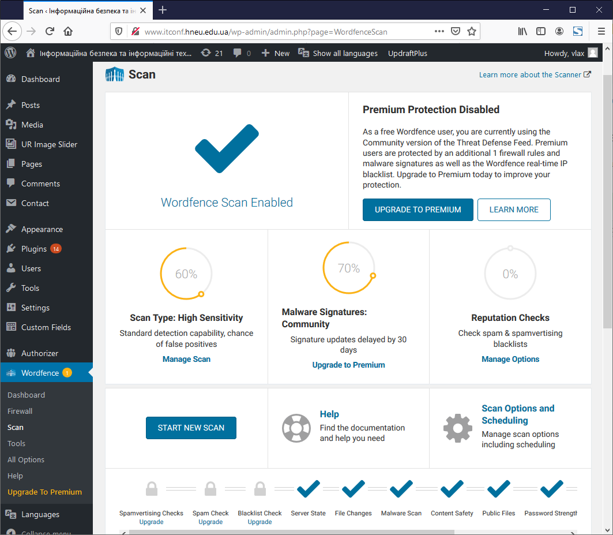

# Особливості розгортання та забезпечення безпеки сайту на WordPress

Підтримка та розвиток інформаційних ресурсів [ХНЕУ ім. С. Кузнеця](https://www.hneu.edu.ua/). Кафедра [кібербезпеки та інформаційних технологій](http://www.kafcbit.hneu.edu.ua/).

---


## Загальна інформація

Для організації сучасного веб-сайту та його швидкого розгортання одним з оптимальних рішень є залучення  системи керування вмістом ([CMS, Content Management System](https://en.wikipedia.org/wiki/Content_management_system)) з відкритим кодом [WordPress](https://wordpress.org/). Завдяки такому вибору можна у найкоротший термін розробити універсальний веб-сайт, блог, Інтернет-магазин тощо. Завдяки наявності готових шаблонів тем, плагінів, у поєднанні з можливістю їх швидкої розробки, веб-сайт на WordPress можна налаштувати для рішення різноманітних завдань. Наприклад, ресурс, [http://www.itconf.hneu.edu.ua/](http://www.itconf.hneu.edu.ua/), призначений для проведення конференцій має відповідні елементи, наприклад, плагін [Contact Form 7](https://wordpress.org/plugins/contact-form-7/) для виконання реєстрації на заходи. Можна зазначити, що додавання хоча б одного плагіну може бути наслідком появи вразливості сайту. Тому, для розгортання свого ресурсу, слід приділяти увагу вибору відповідних розширень та застосовувати перевірені рішення.

Наприклад, XSS ([Cross Site Scripting](https://en.wikipedia.org/wiki/Cross-site_scripting)) –  тип вразливості інтерактивних інформаційних систем, який виникає, коли на сторінки, які були згенеровані сервером, з якоїсь причини потрапляють користувацькі скрипти. Специфіка подібних атак полягає в тому, що замість безпосередньої атаки сервера зловмисники використовують вразливий сервер для атаки на користувача. Цьому може сприяти наявність форм введення даних та відсутня валідація. Також, загроза типу [SQL ін'єкції](https://en.wikipedia.org/wiki/SQL_injection), може бути задіяний зловмисником, оскільки, застосунок (плагін) працює з базою даних. Така загроза основана на впровадженні в запит довільного SQL-коду.

## Вибір плагіну

Додавання одного плагіну до системи на базі CMS може вплинути на потреби у задіянні інших розширень. Прикладом такого підходу може бути той же плагін Contact Form 7, який потребує у наявності засобів відправлення повідомлень електронною поштою. Такий варіант може бути попередником появи вразливості сайту, що буде у разі компрометації надсилати спам-повідомлення тощо. Звичайно, плагін Contact Form 7 є надійним рішенням, що вчасно оновлюється та має велику кількість встановлень.

 
*Рисунок 1 – Веб-сайт «ІТ конференції, ХНЕУ ім. С.Кузнеця»*

Уникнути вразливості щодо обробки пошти на веб-сайті частково можна, якщо задіяти сервіс поштових розсилок як послугу, наприклад, відомих систем, як Gmail, Ukr.net та ін. Для цього доцільно залучити плагін [Easy WP SMTP](https://uk.wordpress.org/plugins/easy-wp-smtp/), який надає можливості простого конфігурування взаємодії зі стороннім поштовим сервісом. Перевагою такого рішення є користування сервісами, що мають підвищені засоби безпеки, наприклад, Ukr.net потребує явного зазначення та підключення [послуги](https://wiki.ukr.net/IMAP_enable_ua), а також додавання додаткового паролю для роботи зовнішнього додатку. 

 
*Рисунок 2 – Приклад конфігурування плагіну Easy WP SMTP*

Перевагою застосування відкритих систем для побудови веб-сайту є наявність доступу до аудиту вихідного коду компонентів та значна підтримка великої кількості незалежних розробників. Як недолік такого підходу є порівняно велика ймовірність компрометації коду зловмисниками, тому системи на базі відкритих рішень слід постійно оновлювати до поточного стану реалізу та отримувати вихідний код виключно на ресурсах, що мають довіру.

## Розгортання WordPress 

Поруч із цим, постає питання, як слід розгорнути систему WordPress для забезпечення надійного функціонування веб-сайту в умовах навантаження, спрямування на зменшення ресурсів щодо підтримки серверної частини та інші умови забезпечення безпеки? Для цього, слід визначити вірогідні сценарії розгортання серверної платформи для сайту на WordPress. Наприклад, зараз для розгортання веб-сайтів доступно чимало сервісів хостингу та ресурси хмарних обчислень (Cloud Computing). Також  є можливість застосування виділеного серверу. Таке рішення надає можливості одноразового інвестування коштів у обладнання та подальшу експлуатацію веб-серверу з оплатою тільки послуг центру обробки даних (сервісне обслуговування, енергоресурси та Інтернет-трафік).

На платформі такого виділеного серверу ([Dedicated Server](https://en.wikipedia.org/wiki/Dedicated_hosting_service)) доцільно розгорнути систему віртуалізації, що надає уніфікацію середовищу розгортання програмного забезпечення веб-серверу та ефективне рішення резервного копіювання (Backup) всіх даних на рівні файлу сховища віртуальної машини ([VPS, Virtual Private Server](https://en.wikipedia.org/wiki/Virtual_private_server)). Більшість систем серверної віртуалізації є комерційними або потребують кваліфікованого персоналу системних адміністраторів. Відзначимо [Proxmox VE](https://pve.proxmox.com/wiki/Main_Page) – відкриту систему віртуалізації, що підтримує технології [QEMU/KVM](https://en.wikipedia.org/wiki/Kernel-based_Virtual_Machine) та Linux-контейнерів [LXC](https://en.wikipedia.org/wiki/LXC). Ця система швидко розгортається, має зручний веб-інтерфейс керування віртуальними машинами та дозволяє масштабувати рішення, як у межах одного серверу, так й серверної ферми.


*Рисунок 3 – Приклад керування віртуальними машинами у середовищі Proxmox VE* 

Іншим підходом до організації серверного середовища може стати рішення на базі технології віртуалізації [Docker](https://en.wikipedia.org/wiki/Docker_(software)) та, у разі масштабування такого рішення, кластеру [Kubernetes](https://en.wikipedia.org/wiki/Kubernetes). Однак, цей підхід більш виправдовує себе у разі застосування методології DevOps і неперервного циклу інтеграції та доставки веб-застосунків користувачам ([CI/DI, Continuous Integration / Continuous Delivery](https://www.atlassian.com/continuous-delivery/principles/continuous-integration-vs-delivery-vs-deployment)), що фактично стає стандартним в процесах розробки веб-продукту, а не за умови впровадження готових рішень.

Таким чином, можна отримати на стороні серверної платформи зручні засоби розгортання операційної системи у середовищі віртуальної машини та задіяти наявні засоби управління й резервного копіювання на рівні самого серверу. Наступним кроком є розгортання системи WordPress. Для цього на стороні серверу (або віртуальної машини) знадобиться розгорнути веб-сервер, наприклад, Apache або Nginx чи ін., інтерпретатор мови PHP, базу даних MySQL або MariaDB. У разі обслуговування декількох сайтів знадобиться настройка  веб-серверу (засобами Virtual Host) або установка WordPress у режимі [мультисайту](https://www.smashingmagazine.com/2020/01/complete-guide-wordpress-multisite/) (Multisite, також технологія «Network of Sites»).

Значно спростити процедуру розгортання серверних компонентів дозволяє застосування спеціалізованої панелі управління, наприклад, відкритої системи [Vesta Control Panel](https://vestacp.com/), яка надає зручний веб-інтерфейс для керування та моніторингу серверу. Така панель управління дозволяє керувати обліковими записами користувачів, доменними (Domains) іменами та відповідними DNS-записами, поштовими скриньками (Mail), виконувати автоматичне розгортання баз даних, планувати виконанням фонових процесів серверу (Cron Jobs), здійснювати резервне копіювання, надавати статистичні дані щодо роботи серверу та ін.  


*Рисунок 4 – Cередовищє керування та моніторингу Vesta CP*

У такому середовищі достатньо просто розгорнути сучасний веб-сайт. Також, відповідні рішення масштабуються на рівень залучення ресурсів хостинг-провайдерів чи хмарних обчислень. Таким чином, розгортання системи управління вмістом веб-сайту зводиться до створення бази даних, копіювання вихідного коду та забезпечення належних [засобів безпеки при розгортанні](https://www.smashingmagazine.com/2014/05/proper-wordpress-filesystem-permissions-ownerships/):

* всі файли повинні мати права 664;
* всі каталоги системи 775;
* файл конфігурацій wp-config.php повинен мати права 660.

Відповідні права є у системах unix, які записуються за допомогою вісімкової системи числення або символьного запису. Скрипт автоматичного настроювання:

```bash
sudo find . -type f -exec chmod 664 {} +
sudo find . -type d -exec chmod 775 {} +
sudo chmod 660 wp-config.php
```

Після цього користувальницький аккаунт може зчитувати і змінювати власні файли, WordPress (через особистий сервер) може зчитувати і змінювати власні скрипти та CMS може створювати, змінювати і видаляти файли і папки. Інші користувачі не побачать інші облікові дані для бази даних у wp-config.php.

## Забезпечення безпеки WordPress

Наступним кроком розгортання є настоювання розширень-плагінів. Основним плагіном для забезпечення безпеки коментарів від спаму є [Akismet Anti-Spam](https://uk.wordpress.org/plugins/akismet/). Цей плагін перевіряє коментарі, які надають користувачі на веб-сайті. Скрипт плагіну надсилає на перевірку на глобальну базу даних спаму, щоб заборонити певному веб-сайту/користувачу чи [боту](https://uk.wikipedia.org/wiki/%D0%9F%D1%80%D0%BE%D0%B3%D1%80%D0%B0%D0%BC%D0%BD%D0%B8%D0%B9_%D0%B0%D0%B3%D0%B5%D0%BD%D1%82) публікувати зловмисний вміст. Основні функції Akismet: автоматично перевіряє всі коментарі і блокує ті, що схожі на спам. Кожний коментар має статус історії, тому адміністратор можете легко побачити, які коментарі були вилучені або очищені від Akismet, і які були спамовані або неприпущені мо-дератором та ін.

У якості альтернативи Akismet Anti-Spam можна задіяти ресурси хмарних обчислень як систему, що буде відповідати за коментарі на сайті та протидіяти спам-коментарям, наприклад, сервіс [Disqus](https://disqus.com/). 

Засоби операційної системи віртуальної машини, технології файєрволу системи віртуалізації поруч із дотриманням правил розгортання CMS та боротьби зі спамом – це головні компоненти безпеки сайту, однак, не слід недооцінювати засоби спеціалізованих плагінів. Наприклад, [Wordfence Security](https://uk.wordpress.org/plugins/wordfence/) та плагін [Sucuri Security](https://uk.wordpress.org/plugins/sucuri-scanner/). Особливістю таких рішень є те, що ці системи виконують не тільки аудит безпеки, а й поруч із цим виявляють ситуації компрометації сайту, наприклад, зміну вихідних кодів рушія системи управління вмістом.

 
*Рисунок 5 – Застосування плагіну Wordfence для WordPress*

Досить частою проблемою для сайтів за керівництвом WordPress є отримання доступу третьою стороною до вихідних кодів та вбудовую до теми оформлення додаткових скриптів. Звичайно, такі втручання порівняно легко розпізнати за допомогою спеціалізованого плагіну. За умови безкоштовного використання плагінів, звичайно відновлення системи виконується власноруч. Для цього слід вилучити скомпрометований код, замінити на вихідні коди системи CMS та, безумовно, налагодити захист файлової системи веб-серверу, як було визначено раніше, однак слід звернути увагу на конфігурацію веб-сервера. 

За допомогою файлу «.htaccess» можна керувати поведінкою веб-сервера, наприклад, доцільно виконати [рекомендації щодо підвищення безпеки сайту на WordPress](https://hostiq.ua/blog/17-ways-to-secure-wordpress/).

Цілеспрямоване планування розробки та розгортання веб-сайту, поруч із застосуванням відповідних систем автоматизації управління серверною інфраструктурою, надають можливості отримати, як зручний інтерфейс керування наявними ІТ-ресурсами, так й покращити безпеку відповідних рішень, завдяки застосуванню стандартних сценаріїв розгортання. Також, слід зазначити, що для покращення захисту веб-сайту, після розгортання  системи WordPress, доцільно встановити та активувати плагіни, наприклад: Wordfence Security, Sucuri Security, Akismet Anti-Spam чи ін. для покращення безпеки веб-сайту та [UpdraftPlus WordPress Backup](https://wordpress.org/plugins/updraftplus/) для резервного копіювання тощо.

Публікацію підготував: *Володимир Алексієв*.


## Корисні посилання

1. WordPress Security Fundamentals - [Defiant Inc](https://www.wordfence.com/learn/).
2. The Ultimate WordPress Security Guide – Step by Step (2020) - [WPBeginner](https://www.wpbeginner.com/wordpress-security/).
3. Как защитить сайт на WordPress — 17 способов - [HOSTiQ](https://hostiq.ua/blog/17-ways-to-secure-wordpress/).
4. Защита WordPress – 12 Советов, чтобы защитить ваш сайт - [Hostinger](https://www.hostinger.ru/rukovodstva/zashchita-wordpress).
5. Ломаем и защищаем WordPress своими руками - [«Хакер»](https://xakep.ru/2015/05/10/defend-wordpress-yourself/).
6. Установка WordPress - [WP-KAMA](https://wp-kama.ru/handbook/wordpress/ustanovka-wordpress).
7. Корректные права доступа и параметры владения для файлов в WordPress - [Блог про WordPress](https://oddstyle.ru/wordpress-2/stati-wordpress/korrektnye-prava-dostupa-i-parametry-vladeniya-dlya-fajlov-v-wordpress.html).
8. Инструкция по работе с WordPress. Руководство для новичков - [Блог про WordPress](https://oddstyle.ru/instrukciya-po-rabote-s-wordpress-rukovodstvo-dlya-novichkov).