# Встановлення Kali Linux паралельно та всередині Windows 10 без віртуальної машини

Підтримка та розвиток інформаційних ресурсів [ХНЕУ ім. С. Кузнеця](https://www.hneu.edu.ua/). Кафедра [кібербезпеки та інформаційних технологій](http://www.kafcbit.hneu.edu.ua/).

---
У даній статті буде розглянуто два способи установки самого популярного дистрибутива Linux для інформаційної безпеки - Kali Linux

## Підготовка до встановлення Kali Linux поруч з Windows 10

Kali Linux можна використовувати в якості додаткової системи, залишивши на ПК і Windows 10. Для цього потрібно встановити дистрибутив Kali разом з Windows.
Linux і Windows не можуть використовувати один і той же розділ. Тому для спільної установки буде потрібно виділити вільне місце для Kali Linux. Зробити це можна прямо з встановленої Windows 10.
Спочатку потрібно відкрити інструмент для управління Windows10 - наприклад, через правий клік по іконці комп'ютера на робочому столі.

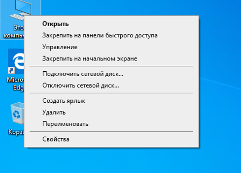

*Рисунок 1 – Пошук інструмента управління дисками*

Перейдемо до меню управління дисковим простором у Windows 10

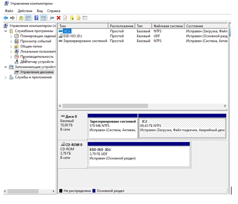

*Рисунок 2 – Меню управління дисками Win10*

Тепер потрібно вибрати «Стиснути том» для диска С: (на ньому стоїть Windows 10) з контекстного меню.

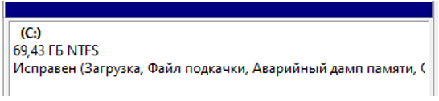

*Рисунок 3 – Том для стиснення*

Після пророблених нами дій відкриється вікно, в якому необхідно вказати розмір стискання. Для встановлення Linux дистрибутиву будє достатньо 20 або більше гігабайтів вільного місця, для комфортної роботи з системою ми обираємо 30 гігабайтів.

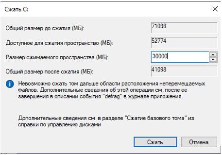

*Рисунок 4 – Стискаємо том*

Тепер ми маємо вільне місце для встановлення ОС, вільне місце в панелі управління відмічається чорним кольором та має характерний заголовок "Не розподілена".

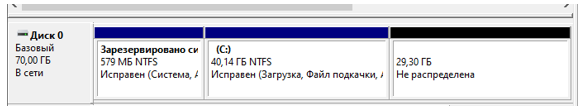

*Рисунок 5 – Результат розподілення вільного місця під Kali Linux*

Тепер можна перезавантажуватися і запускати інсталятор Kali з флешки або з DVD.

## Встановлення на нерозподілене місце

Необхідно завантажитися з носія Kali Linux і вибрати пункт Graphical Install.

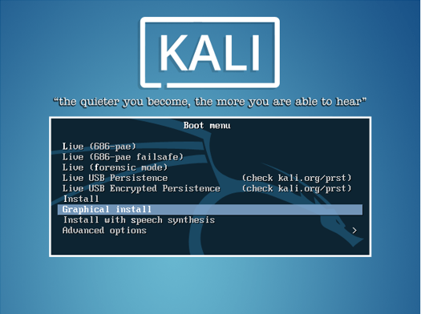

*Рисунок 6 – Меню встановлення*

Перейдемо до мовних налаштуваннь:

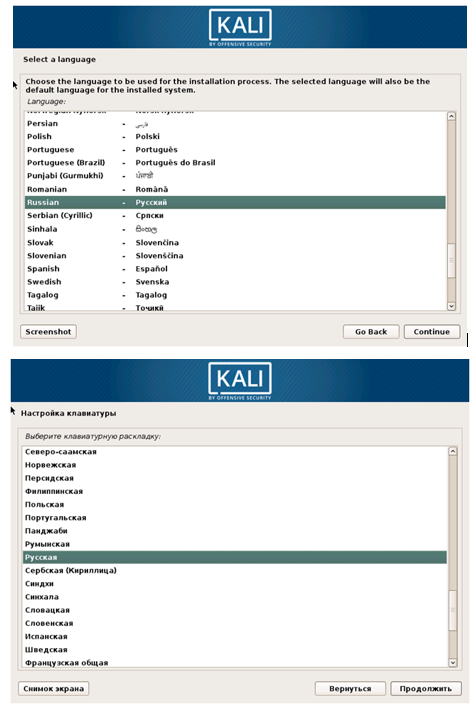

*Рисунок 7 – Мовні налаштування*

Та обираємо зручну для нас розкладку зміни мови клавіатури

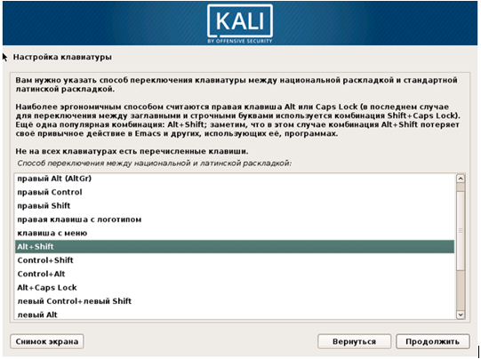

*Рисунок 8 – Зміна розкладки*

Далі Linux налаштує мережу в автоматичному режимі :

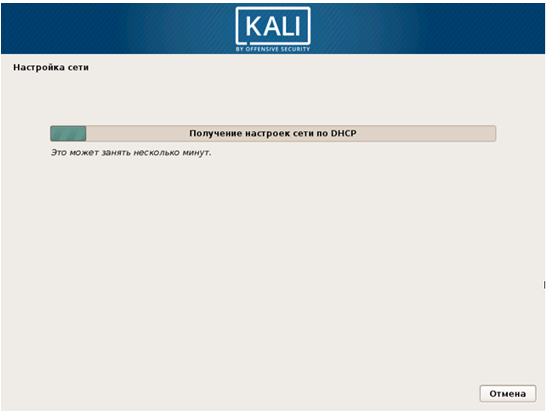

*Рисунок 9 – Налаштування мережі*

Далі необхідно буде ввести пароль для суперкористувача Kali.

*Рисунок 10 – Встановлення паролю суперкористувача*

Наступний крок установки найважливіший: на етапі розмітки дисків потрібно вказати інсталятору, як встановити Linux.
Раніше нами було підготовлено незайнятого простору, потрібно вибрати пункт «Авто - використовувати найбільше вільне місце».

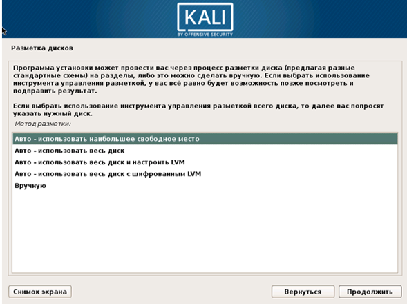

*Рисунок 11 – Розмітка дискового простору*

За замовчуванням пропонується всі дані Linux помістити в єдиному новому розділі. Можна погодитися або винести частину системи на окремі розділи.

*Рисунок 12 – Вибір шляху встановлення*

Інсталятор покаже покаже структуру (розділи Windows 10 відображаються з типом ntfs).

*Рисунок 13 – Існуючі розділи*

Необхідно підтвердити внесення змін.

*Рисунок 14 – Прийняття змін у дисковому просторі*

Після чого починається встановлення системи:

*Рисунок 15 – Процес встановлення*

Kali Linux запитає, чи використовувати дзеркало архіву. Якщо образ скачували давно, могли з'явитися поновлення для програм і варто підключити репозиторій Linux.

*Рисунок 16 – Процес встановлення*

Нарешті, необхідно встановити на диск завантажувач GRUB - саме він дозволяє коректно поставити Linux поруч з Windows 10 і вибирати, яку ОС запустити.

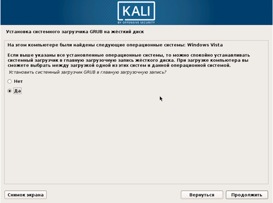

*Рисунок 17 – Встановлення системи завантаження GRUB*

Після цього з'явиться повідомлення про завершення установки Linux. Потрібно прибрати носій, з якого встановлені раніше Kali.

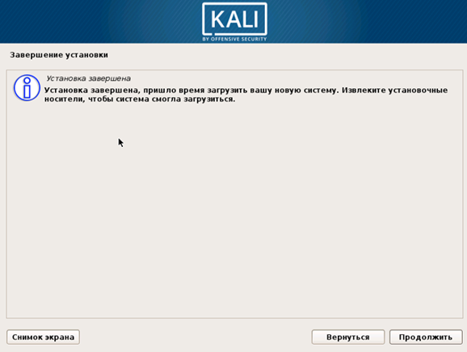

*Рисунок 18 – Успішне завершення встановлення*

---

# Встановлення Kali Linux всередені Windows 10.

## Підготовка стендової машини

Для прикладу встановлення буде використовуватися Virtualbox та образ Windows 10.
Налаштовуємо віртуальну машину під потреби операційної системи.

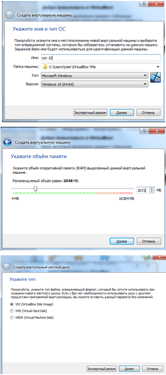

*Рисунок 19 – Налаштування віртуальної машини*

Перейдемо до встановлення Windows 10 на ВМ

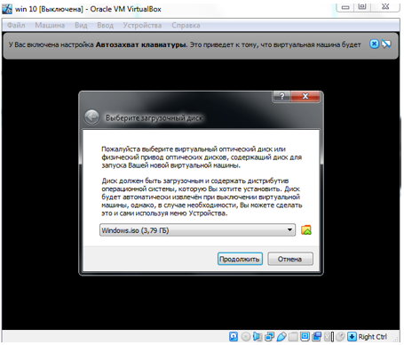

*Рисунок 20 – Обираємо образ ОС*

Далі Windows 10 пропонує вибрати мову

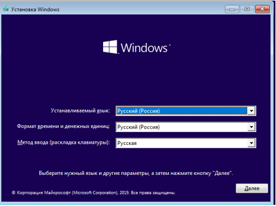

*Рисунок 21 – Обираємо мову ОС*

Для встановлення операційної системи необхідно створити розділ, шляхом форматування вільного простору на диску.

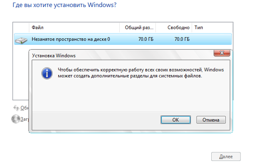

*Рисунок 22 – Підготовка розділу до встановлення ОС*

Після зроблених нами дій розпочинається встановлення операційної системи на створений нами розділ.

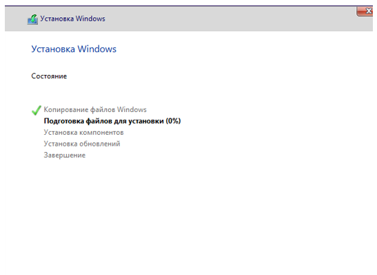

*Рисунок 23 – Процес встановлення ОС*

Для продовження встановлення ОС будемо використовувати автономний обліковий запис, але пізніше потрібно мати обліковий запис Microsot.

*Рисунок 24 – Обліковий запис користувача Win10*

Установка відбувається за допомогою скачування системи Kali Linux з офіційного магазину Microsoft.

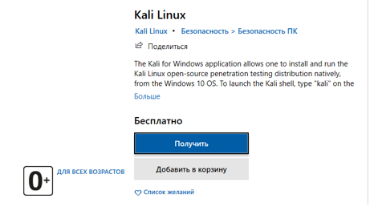

*Рисунок 25 – Сторінка Kali Linux в Microsoft Store*

Починаємо завантаження:

*Рисунок 26 – Процес завантаження підсистеми*

Після завантаження основного додатки, нам необхідно активувати підсистему Linux в Windows 10.
Активуємо чекбокс через установку додаткових компонентів панелі управління (Панель управління -> Програми та засоби -> Включення або відключення компонентів Windows 10 відзначивши галочкою пункт Підсистема Windows для Linux).

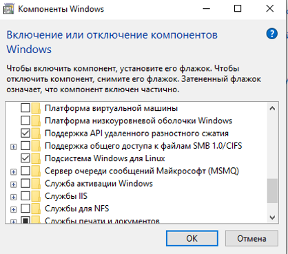

*Рисунок 27 – Підключення підтримки під системи Linux*

Система приймає наші зміни:

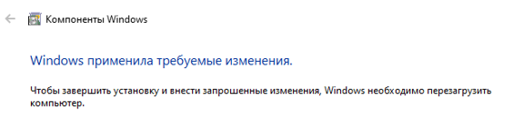

*Рисунок 28 – Windows прийняла налаштування, тепер необхідно перезавантажити ВМ*

Після завантаження системи, заходимо в ПУСК і пишемо Kali:

*Рисунок 29 – Додаток Kali Linux *

Запустивши, система попросить створити користувача і пароль до нього, створіть їх.
Один по одному виконайте наступні команди (потрібне підключення до Інтернету).
 
>sudo apt update >
>sudo apt dist-upgrade >
>sudo apt install -y kali-win-kex >
