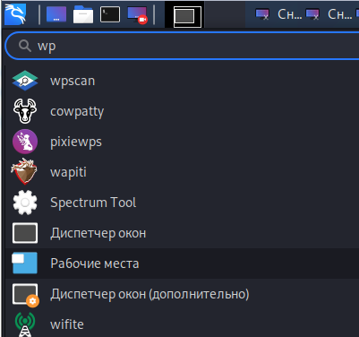
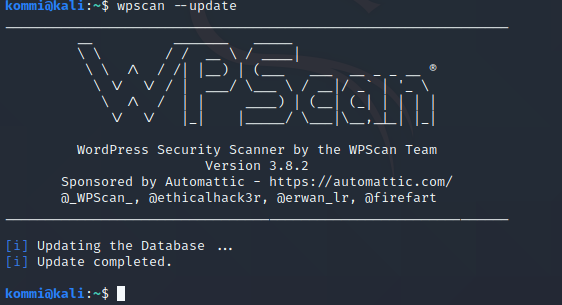
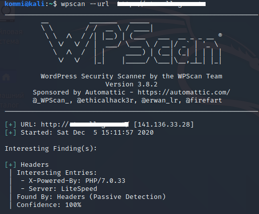
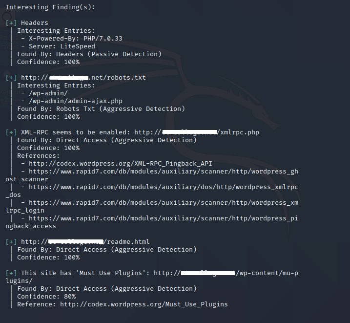
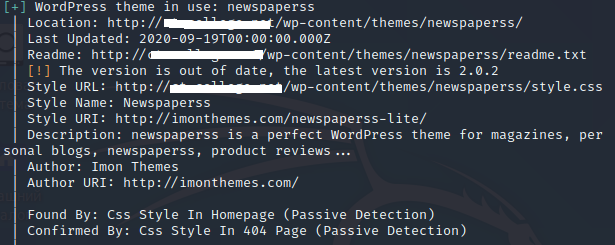
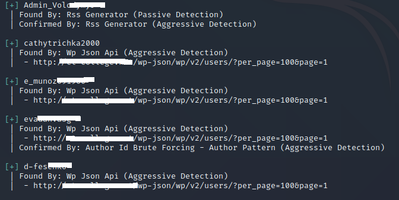
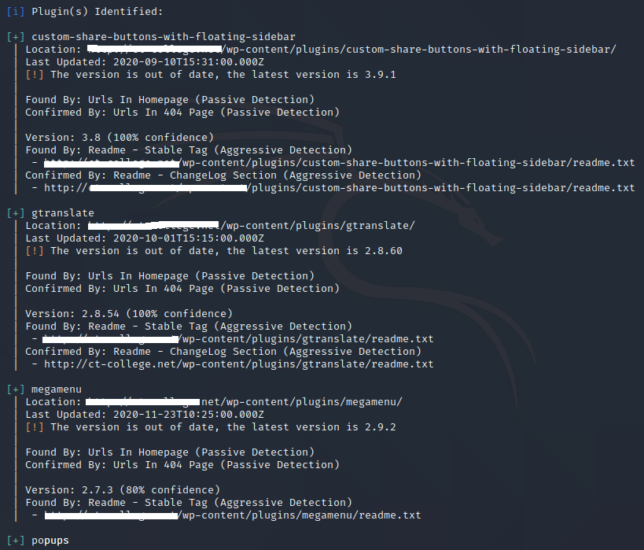

# Сканування сайту на основі CMS Wordpress за допомогою  програми WPScan

Підтримка та розвиток інформаційних ресурсів [ХНЕУ ім. С. Кузнеця](https://www.hneu.edu.ua/). Кафедра [кібербезпеки та інформаційних технологій](http://www.kafcbit.hneu.edu.ua/).

---
Матеріал статті опубліковано суто в освітніх цілях і навчає користувачів аудиту безпеки сайта.

Інструмент WPScan CLI - це безкоштовний для некомерційного використання сканер безпеки WordPress з чорним ящиком, написаний для професіоналів в області безпеки і розробників блогів для перевірки безпеки своїх сайтів. Інструмент WPScan CLI використовує нашу базу даних з 21 865 вразливостей WordPress.


Сайти, що використовують популярні системи управління контентом, такі як WordPress, мають у своїй основі однаковий вихідний код, скрипти. Цей код вже багаторазово перевірений. Використання сканерів загального призначення для пошуку, наприклад, SQL-ін'єкцій, XSS та інших популярних вразливостей в WordPress, навряд чи дасть результати, оскільки це вже багато разів було зроблено до нас.

Проте, дослідники безпеки регулярно знаходять уразливості як в основному коді WordPress, так і в його численних плагінах, темах оформлення. Це означає, що сканувати WordPress потрібно не програмами загального призначення для пошуку вразливість, а спеціалізованою програмою.

## Як використовувати WPScan та підготовка до роботи?

WPScan вже встановлені в ряді ОС для проведення пентесту, таких як:

* SamuraiWTF
* Pentoo
* BlackArch
* Kali Linux

За допомогою пошуку можна знайти дану програму:



Для початку роботи зі сканером потрібно оновити базу вразливостей. Щоб переконатися, що база вразливостей найостанніша, введіть наступну команду для поновлення:



### Пошук вразливостей

Щоб просканувати сайт на предмет присутності потенційних вразливостей, введіть наступну команду (для тестування буде використовуватися невказаний сайт).



Під час сканування були  виявлені наступні знахідки, на які може звернути увагу експерт з безпеки. Як видно на малюнках вище, за допомогою WPScan вдалося з'ясувати деякі деталі цільового сайту.



Серед інформації можна знайти застарілі версії плагінів або самої ЦМС, які вже були скомпрометовані (червоні знаки оклику позначають, що вразливий певний компонент сайту).



Перейдемо до інших можливостей WPScan, за допомогою команди  
```
www.example.com --enumerate u 
```

можливо знайти всі облікові записи адміністраторів та модераторів сайту.



Та ж сама команда з індексом p та t здатна відобразити нам всі використані плагіни та теми на сайті:



Це лише мала частина можливостей сканеру WPScan, яка може бути продемонстрована в ознайомлювальних цілях.

Стаття не буде зачіпати теми брутфорса і використання metasploit, тому що це вийде за рамки навчального ознайомчого матеріалу.

# Підсумки

У даній статті ми ознайомилися з одним з найпопулярніших сканерів безпеки для проведення аудиту безпеки сайта на основі CMS Wordpress.

Публікацію підготував: *Макаренко Антон*.

---

## Корисні посилання

1. https://habr.com/ru/company/alexhost/blog/527612/
2. https://kali.tools/?p=156


